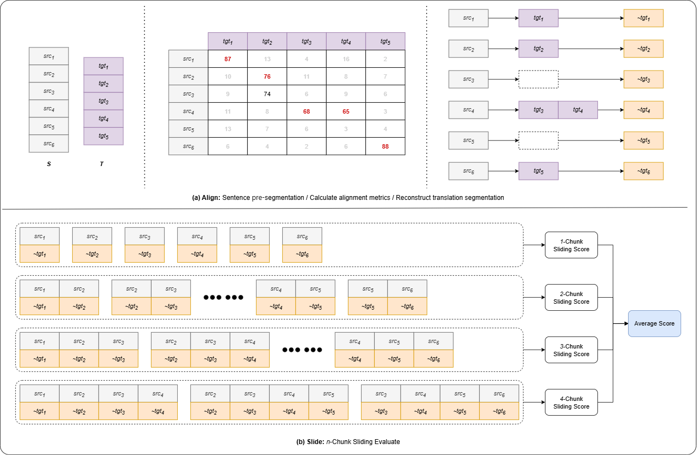

# Align-then-Slide
Align-then-Slide: A complete evaluation framework for Ultra-Long Document-Level Machine Translation (Reproduce)

[paper](https://arxiv.org/abs/2509.03809)

This is a simple reproduction of Align-then-Slide.

For broader language support, please modify the code yourself; we will keep updating it as well.

## Sentence Pre-Segmentation

Currently, in `pre_seg.py`, the `sep_doc` method only provides basic pre-segmentation logic for Chinese and English, following the paper’s setup by using [spaCy](https://spacy.io/models).

Feel free to extend support for additional languages here, or implement Chinese/English pre-segmentation in other ways.

## Alignment Models in Stage 1

At present, the `get_alignment` method in `stage1_align.py` uses [COMETKiwi](https://huggingface.co/Unbabel/wmt22-cometkiwi-da) to compute the alignment matrix.

You can also switch to other alignment models such as [LaBSE](https://huggingface.co/sentence-transformers/LaBSE).

## Alignment Models in Stage 2

In `stage2_slide.py`, we have implemented both reference-free and reference-based computations for flexibility.

The `da_model` can be either [COMET-20](https://huggingface.co/Unbabel/wmt20-comet-da) or [COMET-22](https://huggingface.co/Unbabel/wmt22-comet-da); please adapt other evaluation models on your own.
